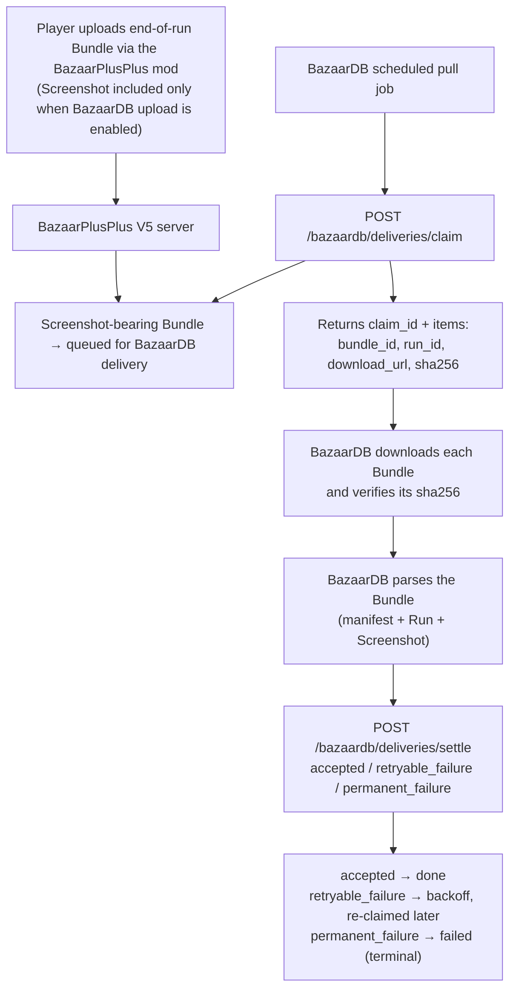

# BazaarPlusPlus × BazaarDB Delivery Integration (V5)

Last updated: 2026-08-03

This document is the integration contract between BazaarPlusPlus V5 and BazaarDB. It supersedes the V4 snapshot integration: the V4 `peek`/`confirm` API and the Snapshot DTO are retired, and V5 delivers complete **Bundles** through a `claim`/`settle` API. A summary of behavioral changes from V4 is at the end of this document.

## Overview

V5 keeps the pull-based delivery model: **players upload end-of-run Bundles to the BazaarPlusPlus server through the BazaarPlusPlus mod, and BazaarDB retrieves them from the BazaarPlusPlus server through a pull API.**

The delivery unit is the **Bundle**: an immutable binary container holding one Run (structured run data and battle summaries) and one end-of-run Screenshot. Screenshot delivery is strictly opt-in on the player side: the mod includes the Screenshot in the uploaded Bundle only while the player has BazaarDB upload enabled, and only Screenshot-bearing Bundles are queued for BazaarDB. BazaarDB therefore never receives a Bundle without a Screenshot.

Every delivered Bundle has already passed structural validation (container prefix, manifest schema, and per-segment digests), so a downloaded Bundle that matches its advertised `sha256` is always well-formed at the container level.

On the BazaarDB side, the integration consists of claiming deliveries, downloading and parsing the Bundles, and settling each delivery with an explicit outcome. How Bundles are associated with BazaarDB accounts is owned by BazaarDB and is outside the scope of this document.

## Data Flow



## API

Base URL:

```text
https://mod-api-v5.bazaarplusplus.com
```

Authentication — both endpoints require the delivery-scoped bearer token issued by BazaarPlusPlus:

```http
Authorization: Bearer <token provided by BazaarPlusPlus>
```

Tokens are scoped per consumer service. A missing or unknown token returns `401 unauthorized`; a valid BazaarPlusPlus token for a different service scope returns `403 insufficient_scope`.

All error responses use a structured envelope:

```json
{
  "error": {
    "code": "invalid_limit",
    "message": "Diagnostic text",
    "retryable": false,
    "request_id": "request-id"
  }
}
```

Match on the HTTP status, `code`, and `retryable`; do not match on `message` text. Every response carries an `X-Request-Id` header — include it when reporting issues to BazaarPlusPlus.

### Claim

Atomically claims the next batch of pending deliveries and places each claimed Bundle under a **10-minute (600-second) lease**.

```http
POST /bazaardb/deliveries/claim
Authorization: Bearer <token>
Content-Type: application/json
```

Optional request body:

```json
{
  "limit": 50
}
```

`limit` defaults to 50 when omitted and accepts 1–50.

Response with items:

```json
{
  "claim_id": "clm_550e8400-e29b-41d4-a716-446655440000",
  "expires_at_ms": 1785629400000,
  "items": [
    {
      "bundle_id": "01J00000000000000000000001",
      "run_id": "run-id",
      "download_url": "https://...",
      "download_expires_at_ms": 1786233800000,
      "content_type": "application/x-bpp-bundle-v5",
      "sha256": "64-lowercase-hex-characters"
    }
  ]
}
```

Response when no deliveries are pending:

```json
{
  "claim_id": null,
  "expires_at_ms": null,
  "items": []
}
```

Notes:

- `sha256` is the digest of the complete Bundle. Verify the downloaded bytes against it before parsing.
- `download_url` is a presigned GET URL valid for **7 days** — much longer than the lease. The URL outliving the lease does not extend the lease: `settle` must still land within the 600-second window. Treat the URL as a bearer capability and do not log it.
- Concurrent claims are supported. There is no single-outstanding-batch restriction and no `409` response: multiple claim calls (or multiple worker instances) may hold leases at the same time, and a given Bundle is never in two valid leases at once.
- If the claim response is lost (network failure after the server committed the claim), there is no recovery endpoint. The lease simply expires after 10 minutes and those Bundles become claimable again. The lost claim still consumed one delivery attempt.

#### Delivery attempts and the lease deadline

- Each delivery may be claimed at most **3 times**.
- **The attempt counter is consumed at claim time**, regardless of whether the subsequent download, parse, or settle succeeds.
- A claimed Bundle must be settled within the 600-second lease. If no settle lands in time, the lease expires and the Bundle returns to the pending queue (until the 3-attempt cap).
- A third claim that again ends without an accepted settle marks the delivery **failed** with `failure_reason: "delivery_attempts_exhausted"`.

**Failed is a terminal state.** A failed delivery is never re-queued, and no API exists to retrieve or revive it. If the pull job repeatedly exhausts deliveries, contact BazaarPlusPlus promptly — recovery is not automatic.

Exhausting attempts should be rare: when BazaarDB determines a Bundle's content is unusable, settle it with `permanent_failure` instead of letting attempts burn out (see below).

### Settle

Reports a per-Bundle outcome for a claim. Partial settlement is supported: a settle request may cover any subset of the claim's items, and the same `claim_id` may be settled across multiple requests.

```http
POST /bazaardb/deliveries/settle
Authorization: Bearer <token>
Content-Type: application/json
```

Request — `results` accepts 1–50 items with unique `bundle_id` values:

```json
{
  "claim_id": "clm_550e8400-e29b-41d4-a716-446655440000",
  "results": [
    { "bundle_id": "01J00000000000000000000001", "outcome": "accepted" },
    { "bundle_id": "01J00000000000000000000002", "outcome": "retryable_failure", "reason": "timeout" },
    { "bundle_id": "01J00000000000000000000003", "outcome": "permanent_failure", "reason": "invalid_data" }
  ]
}
```

Outcomes:

| Outcome | Meaning | Resulting state |
| --- | --- | --- |
| `accepted` | Downloaded, parsed, and persisted | `done` |
| `retryable_failure` | Transient problem (download error, temporary persistence failure) | back to `pending` with backoff; `failed` if this was the third attempt |
| `permanent_failure` | Content BazaarDB will never accept | `failed` immediately, without consuming remaining attempts |

Failure outcomes require a `reason` matching `^[a-z0-9_]{1,64}$`; `accepted` must not include one. After a `retryable_failure`, the Bundle becomes claimable again **60 seconds** after the first attempt and **5 minutes** after the second.

Response:

```json
{
  "claim_id": "clm_550e8400-e29b-41d4-a716-446655440000",
  "items": [
    {
      "bundle_id": "01J00000000000000000000001",
      "status": "applied",
      "state": "done",
      "next_claim_at_ms": null
    }
  ],
  "summary": { "applied": 1, "duplicate": 0, "rejected": 0 }
}
```

Per-item `status`:

- `applied` — this request changed the delivery;
- `duplicate` — the same attempt was already settled with the same outcome and reason (safe: retries of a lost settle response are idempotent);
- `stale_claim` — the lease expired or another claim now owns the Bundle; the item was not applied and will be re-delivered if attempts remain;
- `outcome_conflict` — this attempt was already settled with a different outcome or reason;
- `unknown_item` — the Bundle was never part of this claim.

`state` is the delivery's current state (`pending` / `done` / `failed`; `null` for an unknown item). `next_claim_at_ms` is non-null only for pending work without an active lease and indicates when the Bundle becomes claimable again.

Delivery is **at-least-once within at most 3 claims**; BazaarDB should deduplicate by `bundle_id`. Each Bundle contains exactly one Run, so `run_id` is an equivalent dedup key.

### Error Handling

| Status | Code | Meaning | Recommended action |
| ------ | ---- | ------- | ------------------ |
| 200 | — | Success | Process the response |
| 400 | `invalid_json`, `invalid_limit`, `invalid_settle_request` | Malformed request | Correct the request body |
| 401 | `unauthorized` | Invalid or missing bearer token | Verify the credential |
| 403 | `insufficient_scope` | Token belongs to a different service scope | Use the delivery token |
| 500 | `internal_error` | Unclassified server error | Retry with backoff; report `request_id` if persistent |
| 503 | `storage_unavailable` | Temporary server-side failure | Retry with exponential backoff |

There is no `409` on this API. The `retryable` flag in the error envelope indicates whether a retry can succeed without changing the request.

## Recommended Pull Job

BazaarPlusPlus recommends a scheduled job running every 1–5 minutes:

1. Call `POST /bazaardb/deliveries/claim` (the default `limit` of 50 already claims a full batch).
2. If `items` is empty, end this round.
3. For each item: download `download_url`, verify the bytes against `sha256`, parse the Bundle, and persist, deduplicating by `bundle_id`.
4. Settle incrementally — in small groups as items complete, rather than once at the end — so a job interruption loses as few attempts as possible. Use `accepted` for persisted items, `retryable_failure` (with a reason) for transient errors, and `permanent_failure` (with a reason) for content that will never be accepted.
5. Treat 600 seconds from the claim as a hard deadline for settling; keep the full claim → download → verify → persist → settle cycle comfortably inside it. Size `limit` down if a full batch cannot finish in time.
6. Repeat on the next scheduled run. Claims may overlap; a slow batch does not block the next round.

## Bundle Wire Format

Content type: `application/x-bpp-bundle-v5`. The Bundle is binary:

```text
[16-byte prefix][manifest JSON][Run segment][Screenshot segment]
```

### Prefix

The 16-byte prefix uses unsigned big-endian integers:

| Offset | Bytes | Value |
|---:|---:|---|
| 0 | 8 | ASCII `BPPBNDL5` |
| 8 | 4 | Bundle version `5` |
| 12 | 4 | UTF-8 manifest JSON byte length |

Segment offsets in the manifest are relative to the first payload byte (immediately after the manifest). The Run always starts at offset `0`; the Screenshot starts at the Run length. Segments are contiguous: no gaps, no overlap, and no bytes after the last declared segment.

Digests:

- the claim item's `sha256` covers the **complete downloaded bytes** — prefix, manifest, and all segments;
- each segment's `sha256` in the manifest covers **that segment's bytes alone**;
- all digests are lowercase SHA-256 hex.

### Manifest

Top-level fields:

| Field | Type | Notes |
|---|---|---|
| `bundle_id` | string | Uppercase ULID (26 chars); the dedup key |
| `bundle_version` | integer | Always `5` |
| `created_at_ms` | integer | Unix epoch milliseconds |
| `run` | object | See below |
| `screenshot` | object | Always present in BazaarDB deliveries |

`run`:

| Field | Type | Notes |
|---|---|---|
| `run_id` | string | Identifier (see character rules below) |
| `player_account_id` | string | The uploading player's in-game account ID |
| `run_format_version` | integer | Always `5` |
| `projection.run` | object | Reserved run-level summary; treat as opaque |
| `projection.battles` | array | 0–30 battle summaries, unique `battle_id` per Bundle |
| `payload.offset` | integer | Always `0` |
| `payload.length` | integer | 1–2,097,151 bytes |
| `payload.sha256` | string | 64 lowercase hex chars; digest of the Run segment |
| `payload.content_type` | string | Always `application/x-bpp-run-v5` |

Each entry of `projection.battles`:

| Field | Type | Notes |
|---|---|---|
| `battle_id` | string | Identifier |
| `recorded_at_ms` | integer | Unix epoch milliseconds |
| `day` | integer | In-run day |
| `hour` | integer | In-run hour |
| `encounter_id` | string \| null | |
| `combat_kind` | string | e.g. `pvp` |
| `result` | string | e.g. `win`, `loss` |
| `winner_combatant_id` | string \| null | |
| `loser_combatant_id` | string \| null | |
| `is_final_battle` | boolean | `true` on the run's final battle |
| `player` | combatant | The uploading player |
| `opponent` | combatant | |

Combatant (all nullable fields are present as value or `null`):

| Field | Type |
|---|---|
| `account_id` | string |
| `display_name` | string (max 256) |
| `hero_id` | string \| null |
| `hero_name` | string \| null |
| `rank` | string \| null |
| `rating` | integer \| null |
| `level` | integer \| null |
| `prestige` | integer \| null |
| `victories` | integer \| null |

`screenshot` — the end-of-run image:

| Field | Type | Notes |
|---|---|---|
| `offset` | integer | Relative to first payload byte |
| `length` | integer | 1–1,048,576 bytes |
| `sha256` | string | Digest of the Screenshot segment |
| `content_type` | string | `image/jpeg` or `image/webp` |
| `width` | integer | Pixels |
| `height` | integer | Pixels |
| `quality` | integer | 1–100 encoder quality |
| `captured_at_ms` | integer | Unix epoch milliseconds |

Identifier fields (`run_id`, `player_account_id`, `battle_id`, `account_id`, `combat_kind`, `result`) use 1–128 characters from letters, digits, `.`, `_`, `:`, and `-`, beginning with a letter or digit.

Example:

```json
{
  "bundle_id": "01J00000000000000000000001",
  "bundle_version": 5,
  "created_at_ms": 1785628800000,
  "run": {
    "run_id": "run-id",
    "player_account_id": "account-id",
    "run_format_version": 5,
    "projection": {
      "run": {},
      "battles": [
        {
          "battle_id": "battle-id",
          "recorded_at_ms": 1785628799000,
          "day": 10,
          "hour": 18,
          "encounter_id": null,
          "combat_kind": "pvp",
          "result": "win",
          "winner_combatant_id": "combatant-a",
          "loser_combatant_id": "combatant-b",
          "is_final_battle": true,
          "player": {
            "account_id": "account-id",
            "display_name": "Player",
            "hero_id": null,
            "hero_name": "Vanessa",
            "rank": "Gold",
            "rating": 1234,
            "level": 10,
            "prestige": 2,
            "victories": 9
          },
          "opponent": {
            "account_id": "opponent-id",
            "display_name": "Opponent",
            "hero_id": null,
            "hero_name": "Pygmalien",
            "rank": "Gold",
            "rating": 1200,
            "level": 10,
            "prestige": 3,
            "victories": 8
          }
        }
      ]
    },
    "payload": {
      "offset": 0,
      "length": 123456,
      "sha256": "64-lowercase-hex-characters",
      "content_type": "application/x-bpp-run-v5"
    }
  },
  "screenshot": {
    "offset": 123456,
    "length": 456789,
    "sha256": "64-lowercase-hex-characters",
    "content_type": "image/jpeg",
    "width": 1600,
    "height": 900,
    "quality": 80,
    "captured_at_ms": 1785628800000
  }
}
```

### Reading guidance for BazaarDB

- The end-of-run image is the Screenshot segment; the manifest's `screenshot` entry gives its offset, length, content type, dimensions, and its own `sha256` for per-segment verification.
- The player identity and run summary that V4 carried in the Snapshot DTO now live in the manifest: `run.player_account_id`, plus per-battle `player` blocks (display name, rank, rating, hero, victories). The battle with `is_final_battle: true` reflects the end-of-run state.
- The Run payload segment (`application/x-bpp-run-v5`) is the full structured run data — BazaarDB may ignore it if only the Screenshot and manifest summary are needed.
- Unknown manifest fields must be ignored; the schema may gain fields without notice, while breaking changes will be announced in advance with a migration window.

The complete manifest JSON Schema is inlined in the appendix at the end of this document. Golden test fixtures (valid and invalid Bundle byte vectors) are available from BazaarPlusPlus on request; BazaarPlusPlus recommends validating the parser against them before going live.

## Data Handling

- Screenshot delivery is strictly **opt-in**: the mod includes the end-of-run Screenshot in the uploaded Bundle only while the player has BazaarDB upload enabled, and only Screenshot-bearing Bundles are delivered to BazaarDB.
- A delivery exposes exactly the Bundle contents described above — the player identity as shown in game, the structured run record, and the end-of-run image. Nothing else is collected for this integration.
- Bundles are retained on the BazaarPlusPlus side for **14 days** from upload, after which they are removed by a storage lifecycle rule. Settling a delivery does not delete the Bundle. A delivery still pending when its Bundle passes retention is marked failed with `failure_reason: "bundle_expired"` and is never handed out; under the recommended pull cadence this only occurs after a multi-day outage on the BazaarDB side.

## Changes from the V4 Integration

For teams migrating a V4 pull job:

- **Endpoints**: `POST /bazaardb/peek` → `POST /bazaardb/deliveries/claim`; `POST /bazaardb/confirm` → `POST /bazaardb/deliveries/settle`. Base URL is now `https://mod-api-v5.bazaarplusplus.com`.
- **Delivery unit**: the JSON Snapshot DTO (base64 image inline) is replaced by the binary Bundle (manifest + Run + Screenshot segments). Dedup key changes from `snapshot_id` to `bundle_id`. Screenshot encoding changes from PNG/JPEG base64 to a JPEG/WebP binary segment.
- **Batching**: default batch size grows from 10 to 50 (max stays 50). Claim responses include a `sha256` for download verification.
- **Concurrency**: the one-outstanding-batch rule and its `409` recovery flow are gone; claims may overlap, and a lost claim response is recovered by lease expiry instead of a `409` re-fetch.
- **Settlement**: `confirm` (success-only) becomes per-item `settle` with three outcomes. `permanent_failure` is new: it terminates a bad delivery immediately instead of burning all three attempts. Retryable failures now re-queue with explicit backoff (60 s, then 5 min) rather than waiting for full lease expiry.
- **Lease vs. URL lifetime**: download URLs are valid for 7 days instead of lease-scoped, but the settle deadline is still the 10-minute lease.
- **Retention**: delivery no longer deletes the stored object on confirmation; a fixed 14-day retention governs all Bundles. The `object_gone` failure reason is replaced by `bundle_expired`.
- **Errors**: all errors use a structured envelope with `code`, `retryable`, and `request_id`; wrong-scope tokens return `403 insufficient_scope` instead of `401`. Unchanged: the 10-minute lease, the 3-attempt cap with attempts counted at claim time, and at-least-once delivery semantics.

## Appendix: Manifest JSON Schema

```json
{
  "$schema": "https://json-schema.org/draft/2020-12/schema",
  "$id": "https://bazaarplusplus.com/contracts/v5/manifest.schema.json",
  "title": "BazaarPlusPlus Bundle V5 manifest",
  "type": "object",
  "required": ["bundle_id", "bundle_version", "created_at_ms", "run"],
  "properties": {
    "bundle_id": { "type": "string", "pattern": "^[0-7][0-9A-HJKMNP-TV-Z]{25}$" },
    "bundle_version": { "const": 5 },
    "created_at_ms": { "type": "integer", "minimum": 0 },
    "run": {
      "type": "object",
      "required": ["run_id", "player_account_id", "run_format_version", "projection", "payload"],
      "properties": {
        "run_id": { "$ref": "#/$defs/identifier" },
        "player_account_id": { "$ref": "#/$defs/identifier" },
        "run_format_version": { "const": 5 },
        "projection": {
          "type": "object",
          "required": ["run", "battles"],
          "properties": {
            "run": { "type": "object" },
            "battles": { "type": "array", "maxItems": 30, "items": { "$ref": "#/$defs/battle" } }
          }
        },
        "payload": { "$ref": "#/$defs/runPayload" }
      }
    },
    "screenshot": { "$ref": "#/$defs/screenshot" }
  },
  "$defs": {
    "identifier": { "type": "string", "pattern": "^[A-Za-z0-9][A-Za-z0-9._:-]{0,127}$" },
    "sha256": { "type": "string", "pattern": "^[0-9a-f]{64}$" },
    "nullableString": { "type": ["string", "null"], "maxLength": 256 },
    "nullableInteger": { "type": ["integer", "null"], "minimum": 0 },
    "combatant": {
      "type": "object",
      "required": ["account_id", "display_name", "hero_id", "hero_name", "rank", "rating", "level", "prestige", "victories"],
      "properties": {
        "account_id": { "$ref": "#/$defs/identifier" },
        "display_name": { "type": "string", "maxLength": 256 },
        "hero_id": { "$ref": "#/$defs/nullableString" },
        "hero_name": { "$ref": "#/$defs/nullableString" },
        "rank": { "$ref": "#/$defs/nullableString" },
        "rating": { "$ref": "#/$defs/nullableInteger" },
        "level": { "$ref": "#/$defs/nullableInteger" },
        "prestige": { "$ref": "#/$defs/nullableInteger" },
        "victories": { "$ref": "#/$defs/nullableInteger" }
      }
    },
    "battle": {
      "type": "object",
      "required": ["battle_id", "recorded_at_ms", "day", "hour", "encounter_id", "combat_kind", "result", "winner_combatant_id", "loser_combatant_id", "is_final_battle", "player", "opponent"],
      "properties": {
        "battle_id": { "$ref": "#/$defs/identifier" },
        "recorded_at_ms": { "type": "integer", "minimum": 0 },
        "day": { "type": "integer", "minimum": 0 },
        "hour": { "type": "integer", "minimum": 0 },
        "encounter_id": { "$ref": "#/$defs/nullableString" },
        "combat_kind": { "$ref": "#/$defs/identifier" },
        "result": { "$ref": "#/$defs/identifier" },
        "winner_combatant_id": { "$ref": "#/$defs/nullableString" },
        "loser_combatant_id": { "$ref": "#/$defs/nullableString" },
        "is_final_battle": { "type": "boolean" },
        "player": { "$ref": "#/$defs/combatant" },
        "opponent": { "$ref": "#/$defs/combatant" }
      }
    },
    "runPayload": {
      "type": "object",
      "required": ["offset", "length", "sha256", "content_type"],
      "properties": {
        "offset": { "const": 0 },
        "length": { "type": "integer", "minimum": 1, "maximum": 2097151 },
        "sha256": { "$ref": "#/$defs/sha256" },
        "content_type": { "const": "application/x-bpp-run-v5" }
      }
    },
    "screenshot": {
      "type": "object",
      "required": ["offset", "length", "sha256", "content_type", "width", "height", "quality", "captured_at_ms"],
      "properties": {
        "offset": { "type": "integer", "minimum": 1 },
        "length": { "type": "integer", "minimum": 1, "maximum": 1048576 },
        "sha256": { "$ref": "#/$defs/sha256" },
        "content_type": { "enum": ["image/jpeg", "image/webp"] },
        "width": { "type": "integer", "minimum": 1 },
        "height": { "type": "integer", "minimum": 1 },
        "quality": { "type": "integer", "minimum": 1, "maximum": 100 },
        "captured_at_ms": { "type": "integer", "minimum": 0 }
      }
    }
  }
}
```

The schema marks `screenshot` as optional because the same manifest format also covers Screenshot-less Bundles inside BazaarPlusPlus; every Bundle delivered to BazaarDB carries the `screenshot` entry and segment.
