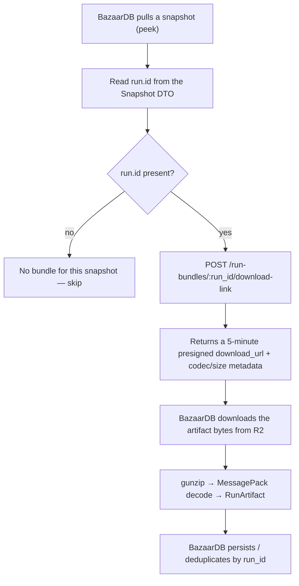

# BazaarPlusPlus × BazaarDB Run Bundle Download Integration

Last updated: 2026-06-24

This is an optional companion to the [Snapshot Integration](./bazaardb-snapshot-integration.md). It lets BazaarDB fetch the **full run bundle** for a run — every battle in that run, with card snapshots and (optionally) replay payloads — by exchanging a `run.id` for a short-lived download URL.

The endpoint is purely additive: the snapshot pull flow (`peek`/`confirm`) is unchanged, and a consumer that ignores this endpoint sees no difference. The authoritative wire contract is [`docs/api-reference.md`](./api-reference.md) (section `POST /run-bundles/:run_id/download-link`); this document is the partner-friendly companion and defers to it on any conflict.

## Overview

Each end-of-run snapshot carries a `run.id` (see the [Snapshot DTO](./bazaardb-snapshot-integration.md#snapshot-dto-schema)). When `run.id` is present, BazaarDB can call this API to download the run bundle artifact for that run and decode it locally.

- **`run.id` is nullable.** Snapshots without a `run.id` have no downloadable bundle — skip them.
- **One bundle per run, not per snapshot.** The bundle is the whole-run artifact, so it covers all of the run's battles regardless of which snapshot you started from.
- **The bundle is binary**, not JSON: gzip-compressed MessagePack. It must be decoded as described under [Run Bundle Artifact](#run-bundle-artifact).

## Data Flow



## Storage Model

The BazaarPlusPlus mod uploads each finished run as a single run bundle artifact to the BazaarPlusPlus server, which stores the raw bytes in private object storage and records `run_id → object_key` in its database. The server:

- resolves `run_id` to the stored object and mints a **5-minute (300-second)** presigned `download_url`;
- returns `codec`, `schema_version`, and `size_bytes` alongside the URL so the consumer can frame and validate the download without a second call;
- never parses the artifact body — it stores and serves the exact bytes the mod uploaded;
- keeps the object key opaque (a random UUID), so it exposes no `run_id` or player identity.

**Retention.** Run bundle objects are auto-deleted by an object-storage lifecycle rule, currently **~7 days** after upload. The contract guarantees a retention floor of **≥ 5 days**. After an object ages out, the database row persists, so the endpoint returns **`410 artifact_expired`** rather than `404`. Download promptly after reading `run.id`; do not assume a bundle is retrievable indefinitely.

## API

Base URL:

```text
https://mod-api-v4.bazaarplusplus.com
```

Authentication — uses the **same bearer token** as the snapshot pull endpoints (`peek`/`confirm`):

```http
Authorization: Bearer <token provided by BazaarPlusPlus>
```

### Download link

Mints a 5-minute presigned download URL for the run bundle of a given `run_id`.

```http
POST /run-bundles/{run_id}/download-link
Authorization: Bearer <token>
```

No request body. `run_id` is taken from the URL path (URL-encode it).

Response:

```json
{
  "run_id": "fab7507c-41a6-4ee6-bbaf-5bea04814b39",
  "download_url": "https://<account>.r2.cloudflarestorage.com/.../<uuid>.mpack.gz?<signed-query>",
  "expires_at_utc": "2026-06-24T00:05:00.000Z",
  "codec": "application/x-bpp-runbundle+msgpack+gzip",
  "schema_version": 5,
  "size_bytes": 539280
}
```

- `download_url` is a 5-minute SigV4 presigned URL — GET it directly (no proxy). After it expires the storage layer may return `403`; request a fresh link rather than scheduling a download against the exact `expires_at_utc` boundary.
- `size_bytes` is the compressed artifact length; use it to sanity-check the download.
- `schema_version` is delivery metadata and is **not** present inside the artifact body.

### Error Handling

| Status | Meaning | Recommended action |
| ------ | ------- | ------------------ |
| 200 | Success | Download and decode the artifact |
| 400 | Malformed `run_id` in the path | Correct the request URL |
| 401 | Invalid or missing bearer token | Verify the credential |
| 404 | `run_not_found` — no run with that `run_id` | The run was never uploaded; skip |
| 410 | `artifact_expired` — the object aged out of retention | Bundle is gone; skip |
| 500 | Server error | Retry with exponential backoff |

Both `404` and `410` are expected in normal operation (a snapshot's run may never have uploaded a bundle, or the bundle may have aged out). Treat them as "no bundle available," not as failures.

## Run Bundle Artifact

GET the `download_url`; the bytes are the run bundle, **not JSON**. Framing:

- The bytes are a gzip stream (first two bytes `0x1F 0x8B`). Gunzip, then decode the result as **MessagePack** (not JSON).
- The MessagePack map is keyed by **C# property names** (`RunId`, `Battles`, `Snapshots`, `ReplayPayload`, …) — PascalCase, *not* the snake_case used by the snapshot upload metadata. Do not decode it as snake_case.
- `ReplayPayload` byte arrays are raw game net messages (MessagePack/LZ4), not JSON. Consumers that only need card snapshots and metadata can ignore them.

Top-level decoded shape:

```ts
interface RunArtifact {
  RunId: string;
  Battles: RunArtifactBattle[];
}

interface RunArtifactBattle {
  BattleId: string;
  Manifest: {
    BattleId: string | null;
    RecordedAtUtc: string;       // ISO-8601 UTC
    Day: number | null; Hour: number | null;
    EncounterId: string | null; CombatKind: string | null;  // e.g. "PVPCombat"
    Result: string | null;       // "win" | "loss" | …
    WinnerCombatantId: string | null; LoserCombatantId: string | null;
  };
  Participants: {
    PlayerName: string | null; PlayerAccountId: string | null; PlayerHero: string | null;
    PlayerRank: string | null; PlayerRating: number | null; PlayerLevel: number | null;
    PlayerPrestige: number | null; PlayerVictories: number | null;
    OpponentName: string | null; OpponentAccountId: string | null; OpponentHero: string | null;
    OpponentRank: string | null; OpponentRating: number | null; OpponentLevel: number | null;
    OpponentPrestige: number | null; OpponentVictories: number | null;
  };
  Snapshots: {
    // Exactly four CardSets per battle, in order:
    // player_hand, player_skills, opponent_hand, opponent_skills.
    CardSets: Array<{
      Label: string;            // e.g. "player_hand"
      Status: string | null;    // "Missing" | "CapturedEmpty" | "Captured"
      Source: string | null;    // "Unknown" | "OpeningMessage" | "LiveRetry"
      Items: Array<{
        InstanceId: string; TemplateId: string;
        Type: number;             // ECardType — see table below
        Size: number;             // ECardSize: 1=Small, 2=Medium, 3=Large
        Section: number | null;   // EInventorySection: 0=Hand, 1=Stash
        Socket: number | null;    // EContainerSocketId: 0..9
        Name: string | null; Tier: string | null; Enchant: string | null;
        Tags: string[];
        Attributes: Record<string, number>;
      }>;
    }>;
  };
  ReplayPayload: {
    BattleId: string;
    Version: number;
    SpawnMessageBytes: Uint8Array;   // raw game net messages — NOT JSON
    CombatMessageBytes: Uint8Array;
    DespawnMessageBytes: Uint8Array;
  };
}
```

`Type` is the `ECardType` enum as an integer:

| Value | Name | Value | Name |
|---:|---|---:|---|
| 0 | Item | 5 | PedestalEncounter |
| 1 | Skill | 6 | PvpEncounter |
| 2 | CombatEncounter | 7 | SocketEffect |
| 3 | EncounterStep | 8 | PlayerEffect |
| 4 | EventEncounter | | |

## Minimal Pull + Decode Script

Self-contained Python — the only third-party dependency is `msgpack` (`pip install msgpack`):

```python
#!/usr/bin/env python3
"""Fetch and decode a run bundle by run_id. Usage: python pull_run_bundle.py <run_id>"""
import gzip
import json
import sys
import urllib.error
import urllib.request

import msgpack

HOST = "https://mod-api-v4.bazaarplusplus.com"
TOKEN = "<your BazaarPlusPlus bearer token>"
# Cloudflare bot protection (error 1010) bans the default Python-urllib User-Agent.
# Send any normal UA — without this the request is rejected before it reaches the API.
USER_AGENT = "bazaardb-run-bundle-pull/1.0"


def fetch_run_bundle(run_id: str) -> dict:
    # 1) Mint a 5-minute presigned download URL.
    link_req = urllib.request.Request(
        f"{HOST}/run-bundles/{run_id}/download-link",
        method="POST",
        headers={"Authorization": f"Bearer {TOKEN}", "User-Agent": USER_AGENT},
    )
    with urllib.request.urlopen(link_req) as resp:
        link = json.loads(resp.read())

    # 2) Download the raw artifact bytes from object storage.
    dl_req = urllib.request.Request(link["download_url"], headers={"User-Agent": USER_AGENT})
    with urllib.request.urlopen(dl_req) as resp:
        raw = resp.read()
    assert len(raw) == link["size_bytes"], "downloaded size does not match size_bytes"

    # 3) gunzip, then MessagePack-decode. Map keys are C# PascalCase property names.
    return msgpack.unpackb(gzip.decompress(raw), raw=False, strict_map_key=False)


def main() -> int:
    if len(sys.argv) < 2:
        sys.exit("usage: pull_run_bundle.py <run_id>")
    run_id = sys.argv[1]
    try:
        artifact = fetch_run_bundle(run_id)
    except urllib.error.HTTPError as exc:
        # 404 run_not_found / 410 artifact_expired are expected: no bundle available.
        print(f"no bundle for {run_id}: HTTP {exc.code} {exc.read().decode(errors='replace')}")
        return 0

    print(f"RunId={artifact['RunId']} battles={len(artifact['Battles'])}")
    for battle in artifact["Battles"]:
        manifest = battle["Manifest"]
        card_sets = [
            (cs["Label"], cs["Status"], len(cs["Items"]))
            for cs in battle["Snapshots"]["CardSets"]
        ]
        print(f"  {battle['BattleId']} {manifest['CombatKind']} {manifest['Result']} {card_sets}")
    return 0


if __name__ == "__main__":
    raise SystemExit(main())
```

Example output (a 12-battle run):

```text
RunId=fab7507c-41a6-4ee6-bbaf-5bea04814b39 battles=12
  fad03a06ff704ea6a52b7573bed8e496 PVPCombat win [('player_hand', 'Captured', 5), ('player_skills', 'Captured', 1), ('opponent_hand', 'Captured', 4), ('opponent_skills', 'Captured', 1)]
  ...
```

## Recommended Usage

1. During the snapshot pull, read `run.id` from each Snapshot DTO. If it is `null`, there is no bundle — skip.
2. Call `POST /run-bundles/{run_id}/download-link`. Handle `404`/`410` as "no bundle available."
3. Download the `download_url` promptly — the URL is valid for 5 minutes, and the object itself is retained for only ~7 days after upload.
4. gunzip + MessagePack-decode the bytes into a `RunArtifact`.
5. Persist and deduplicate by `run_id` (one bundle covers the whole run).

## Data Handling

- A run bundle contains the run's battles: per-battle manifest, participants, the four card-set snapshots (player/opponent hand and skills), and optional replay payloads.
- Replay payloads are raw game net messages intended for replay reconstruction; they carry no additional player identity beyond what is already in the manifest/participants.
- The BazaarPlusPlus server serves the exact bytes the mod uploaded and performs no analysis on the artifact body.
