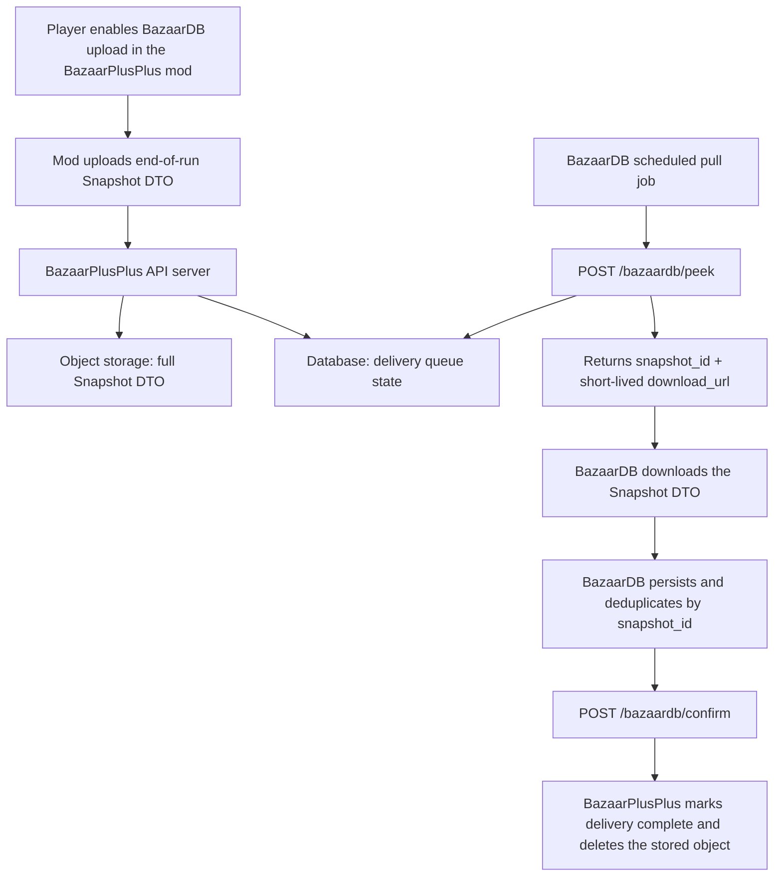

# BazaarPlusPlus × BazaarDB Snapshot Integration

Last updated: 2026-06-12

This integration is generally available: the new BazaarPlusPlus client was rolled out to all users during the weekend of June 6–7, 2026. The API and the Snapshot DTO schema are stable; any breaking change will be announced to BazaarDB in advance, with a migration window.

## Overview

BazaarPlusPlus uses a pull-based delivery model: **players upload end-of-run snapshots to the BazaarPlusPlus server through the BazaarPlusPlus mod, and BazaarDB retrieves those snapshots from the BazaarPlusPlus server through a pull API.**

Players no longer configure a personal access token (PAT). The mod provides an opt-in BazaarDB upload toggle; when a player enables it, the mod uploads an end-of-run snapshot to the BazaarPlusPlus server automatically.

On the BazaarDB side, the integration consists of pulling snapshots from the API described below. How snapshots are associated with BazaarDB accounts is owned by BazaarDB and is outside the scope of this document.

## Data Flow



## Storage Model

The BazaarPlusPlus mod uploads the full Snapshot DTO to the BazaarPlusPlus server. The server:

- stores the full Snapshot DTO in object storage;
- tracks delivery state in a queue;
- exposes each DTO to BazaarDB through a short-lived `download_url` (valid for the duration of the peek lease);
- deletes the stored object once BazaarDB confirms delivery.

The server performs only minimal validation (for example, verifying that `snapshot.id` matches the upload path). It does not extract images, compute meta builds or card win rates, or perform any other analysis; the DTO is delivered to BazaarDB as uploaded.

## API

Base URL:

```text
https://mod-api-v4.bazaarplusplus.com
```

Authentication — both endpoints require the bearer token issued by BazaarPlusPlus:

```http
Authorization: Bearer <token provided by BazaarPlusPlus>
```

### Peek

Claims the next pending delivery batch and places it under a 10-minute (600-second) lease.

```http
POST /bazaardb/peek
Authorization: Bearer <token>
Content-Type: application/json
```

Optional request body:

```json
{
  "max_items": 10
}
```

`max_items` defaults to 10 when omitted and is clamped to the range 1–50. Larger batches are opt-in: omitting the field preserves the original batch size of 10.

Response with items:

```json
{
  "peek_id": "pk_...",
  "lease_expires_at_utc": "2026-06-03T12:40:00.000Z",
  "items": [
    {
      "snapshot_id": "snapshot-id",
      "download_url": "https://..."
    }
  ]
}
```

Response when no snapshots are pending:

```json
{
  "peek_id": null,
  "items": []
}
```

At most one peek batch may be outstanding at a time. If a previous batch is still leased and not yet fully confirmed, the server responds with `409`:

```json
{
  "status": "peek_outstanding",
  "peek_id": "pk_...",
  "lease_expires_at_utc": "2026-06-03T12:40:00.000Z",
  "items": [
    { "snapshot_id": "string", "download_url": "https://<account>.r2.cloudflarestorage.com/..." }
  ]
}
```

The `items` array has the same `{ snapshot_id, download_url }` shape as the 200 response. A job that lost its original peek response can use this to re-download and confirm the outstanding batch immediately, without waiting for the lease to expire. The re-fetch does not consume a delivery attempt and does not extend the lease.

To resolve a `409`, use the returned `items` to re-download the outstanding batch and confirm, or wait for the lease to expire. When a lease expires, unconfirmed snapshots return to the pending queue, provided they remain under the delivery-attempt cap described below.

#### Delivery attempts and the confirm deadline

- Each snapshot may be claimed by `peek` at most **3 times**.
- **The attempt counter is consumed at `peek` time, not at download time.** Every `peek` response that includes a snapshot consumes one attempt immediately, regardless of whether the subsequent download or persistence succeeds.
- A claimed snapshot must be confirmed within the **600-second lease window**. If `confirm` does not land in time — because the download failed, persistence failed, the job crashed, or the confirm simply ran late — the lease expires and the next `peek` re-claims the snapshot, consuming the next attempt.
- Three claims without a successful `confirm`, for any reason, exhaust the snapshot: the next `peek` marks it **failed**.

Treat 600 seconds from `peek` as a hard deadline for `confirm`, and keep the full peek → download → persist → confirm cycle comfortably inside it.

**Failed is a terminal state.** A failed snapshot is never re-queued or re-delivered, and the queue treats its data as lost. The stored object is not deleted immediately — it is removed later by a storage lifecycle rule — but no API exists to retrieve or revive a failed snapshot, and re-uploading the same `snapshot_id` does not revive it. If the pull job repeatedly exhausts snapshots (persistent download failures, or confirms missing the lease window), contact BazaarPlusPlus promptly: the server raises an internal alarm on mass delivery failures, but recovery is not automatic. A snapshot whose stored object has aged out of the lifecycle window is also reported as failed (`failure_reason='object_gone'`) and never appears in a peek batch.

### Confirm

Confirms the snapshots that BazaarDB has successfully downloaded and persisted. Partial confirmation is supported: a confirm request may cover any subset of the items from a peek batch, and the same `peek_id` may be confirmed across multiple requests.

```http
POST /bazaardb/confirm
Authorization: Bearer <token>
Content-Type: application/json
```

Request — `snapshot_ids` accepts at most 50 unique IDs per request (one full peek batch):

```json
{
  "peek_id": "pk_...",
  "snapshot_ids": ["snapshot-id-a", "snapshot-id-b"]
}
```

Response:

```json
{
  "confirmed": ["snapshot-id-a", "snapshot-id-b"],
  "count": 2
}
```

`confirmed` only includes snapshot IDs that still match the active peek lease and have not already been confirmed. Confirming the same IDs again returns an empty list.

Delivery is **at-least-once within at most 3 peek claims**; BazaarDB should deduplicate by `snapshot_id`.

### Error Handling

| Status | Meaning | Recommended action |
| ------ | ------- | ------------------ |
| 200 | Success | Process the response |
| 400 | Malformed request | Correct the request body |
| 401 | Invalid or missing bearer token | Verify the credential |
| 409 | An earlier peek lease is still outstanding | Confirm the outstanding peek or wait for lease expiry |
| 500 | Server error | Retry with exponential backoff |

## Recommended Pull Job

BazaarPlusPlus recommends a scheduled job running every 1–5 minutes:

1. Call `POST /bazaardb/peek`.
2. If `items` is empty, end this round.
3. Download each `download_url`.
4. Persist each Snapshot DTO, deduplicating by `snapshot_id`.
5. Call `POST /bazaardb/confirm` with the IDs that were successfully persisted. Confirming incrementally — in small groups as items are persisted, rather than once at the end of the batch — limits the number of attempts lost if the job is interrupted. Unconfirmed items are re-delivered after lease expiry until the 3-attempt cap is reached.
6. Repeat on the next scheduled run.

When working through a backlog, request larger batches explicitly (up to `"max_items": 50`) to drain the queue faster.

## Snapshot DTO Schema

Current schema version: `2`

```ts
type BazaarDbSnapshotUploadRequest = {
  schema_version: 2;
  snapshot: {
    id: string;
    source: string;              // currently "end_of_run_auto"
    captured_at_utc: string;     // ISO-8601 UTC timestamp
  };
  player: {
    account_id: string;
    display_name: string | null;
    rank: string | null;
    rating: number | null;
    leaderboard_position: number | null;
  };
  run: {
    id: string | null;
    day: number | null;
    wins: number | null;
    losses: number | null;       // currently often null
    hero: {
      id: string | null;         // currently often null
      name: string | null;
    };
  };
  image: {
    content_type: "image/png" | "image/jpeg";  // stored opaquely; may be a JPEG derivative
    encoding: "base64";
    data_base64: string;
  };
  client: {
    submitted_at_utc: string;    // ISO-8601 UTC timestamp
  };
};
```

Example:

```json
{
  "schema_version": 2,
  "snapshot": {
    "id": "snapshot-id",
    "source": "end_of_run_auto",
    "captured_at_utc": "2026-06-03T12:34:56.000Z"
  },
  "player": {
    "account_id": "player-account-id",
    "display_name": "PlayerName",
    "rank": "Gold",
    "rating": 1234,
    "leaderboard_position": 12
  },
  "run": {
    "id": "run-id",
    "day": 10,
    "wins": 9,
    "losses": null,
    "hero": {
      "id": null,
      "name": "Vanessa"
    }
  },
  "image": {
    "content_type": "image/png",
    "encoding": "base64",
    "data_base64": "..."
  },
  "client": {
    "submitted_at_utc": "2026-06-03T12:35:00.000Z"
  }
}
```

## Data Handling

- Snapshot uploads are strictly **opt-in**: the mod sends snapshots only while the player has the BazaarDB upload toggle enabled.
- A snapshot contains exactly the fields listed in the DTO schema above — the player identity as shown in game, a summary of the finished run, and the end-of-run image. Nothing else is collected for this integration.
- The BazaarPlusPlus server acts as a relay, not an archive: each stored snapshot object is deleted as soon as BazaarDB confirms delivery, and undeliverable snapshots are removed by a storage lifecycle rule.
