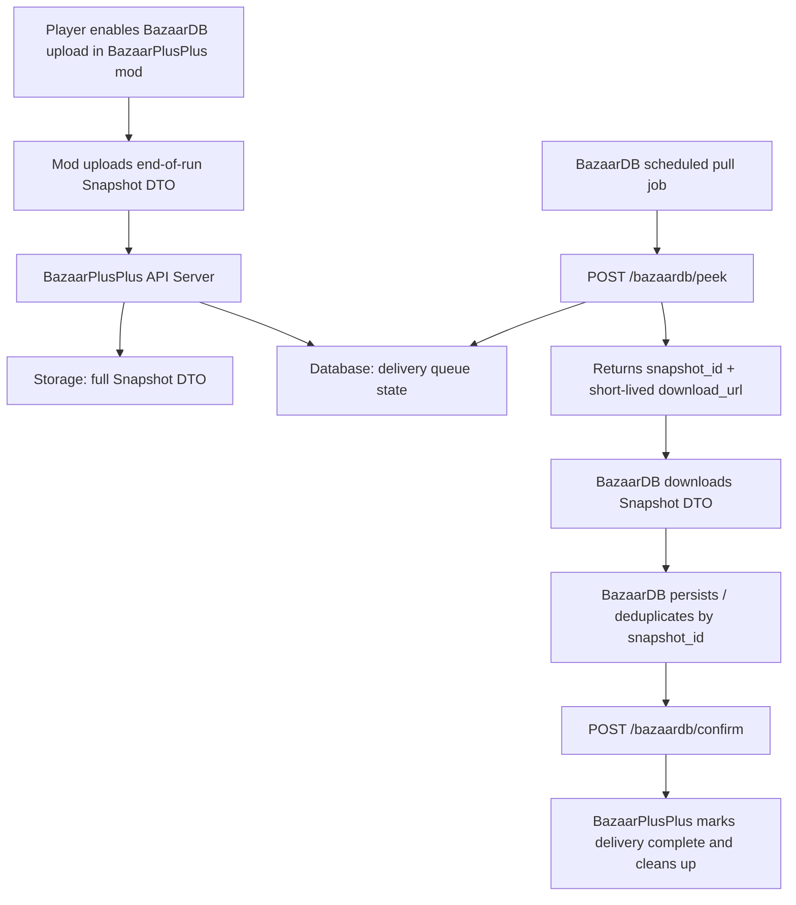

# BazaarPlusPlus x BazaarDB Snapshot Integration

Last updated: 2026-06-07

The new version of BazaarPlusPlus is currently in **preview** and may still have some rough edges. We plan to roll it out to all users over the **weekend of June 6–7, 2026**. Between now and the full rollout, the API and DTO schema may undergo minor changes; we will notify you in advance of any breaking changes.

## Overview

We have switched to a model where **players upload data to the BazaarPlusPlus server via the BazaarPlusPlus mod, and BazaarDB pulls snapshots from the BazaarPlusPlus server**.

Players no longer need to configure a PAT. The BazaarPlusPlus mod provides a BazaarDB upload toggle — players who want to contribute data can enable it themselves. Once enabled, the mod uploads an end-of-run snapshot to the BazaarPlusPlus server.

BazaarDB only needs to pull snapshots from us and bind records on your side using `player.display_name` (the in-game player name).

## Data Flow



## Storage Model

The BazaarPlusPlus mod uploads the full Snapshot DTO to the BazaarPlusPlus server.

The server:

- Stores the full Snapshot DTO
- Tracks delivery queue state
- Exposes the DTO to BazaarDB via short-lived `download_url`s (valid for the duration of the peek lease)
- Deletes the stored snapshot after BazaarDB confirms delivery

The server performs only minimal validation (e.g., verifying that `snapshot.id` matches). It does not extract images, generate meta builds, compute card win rates, or perform any complex analysis.

## API

Base URL:

```text
https://mod-api-v4.bazaarplusplus.com
```

Auth:

```http
Authorization: Bearer <token provided by BazaarPlusPlus>
```

### Peek

Claim the next pending delivery batch.

```http
POST /bazaardb/peek
Authorization: Bearer <token>
Content-Type: application/json
```

Optional request body:

```json
{
  "max_items": 10
}
```

`max_items` defaults to 10 if omitted. The maximum allowed value is 10.

Response with items:

```json
{
  "peek_id": "pk_...",
  "lease_expires_at_utc": "2026-06-03T12:40:00.000Z",
  "items": [
    {
      "snapshot_id": "snapshot-id",
      "download_url": "https://..."
    }
  ]
}
```

Response when no pending data exists:

```json
{
  "peek_id": null,
  "items": []
}
```

If a previous batch is still leased and not yet confirmed, the server returns `409`:

```json
{
  "status": "peek_outstanding",
  "peek_id": "pk_...",
  "lease_expires_at_utc": "2026-06-03T12:40:00.000Z"
}
```

To resolve a 409, either confirm (or partially confirm) the outstanding peek, or wait for its lease to expire. Once the lease expires, unconfirmed snapshots return to the pending queue while they are still under the delivery-attempt cap. Each snapshot can be claimed at most 3 times; after that, the next `peek` marks it failed.

**The attempt counter is consumed at `peek` time, not at download time.** Every `peek` that hands you a snapshot spends one of its 3 attempts immediately, regardless of whether your download or persistence then succeeds. You must `POST /confirm` that `snapshot_id` within the 600-second lease window; if you do not (download failed, persistence failed, your job crashed, or `confirm` simply ran later than the lease), the lease expires and the next `peek` re-claims it and spends the next attempt. Three claims without a successful `confirm` — for any reason, not only download 403s — exhaust the snapshot and mark it failed. Practical SLA: treat 600 seconds from `peek` as the hard deadline to `confirm`, and keep your peek→download→persist→confirm cycle well inside it.

Failed is a terminal state: the snapshot is never re-queued or re-delivered, and that data is accepted as lost from the queue's perspective. The stored object is not deleted immediately — it is cleaned up later by a storage lifecycle rule — but there is no API to retrieve or revive a failed snapshot, and re-uploading the same `snapshot_id` will not revive it (even after the lifecycle rule has removed the object). If your pull job repeatedly exhausts snapshots (downloads failing, or confirms not landing inside the lease), contact us before the queue burns through — the server raises an internal alarm on mass failures, but recovery on our side is not automatic.

### Confirm

Confirm snapshots that BazaarDB has successfully downloaded and persisted. Partial confirmation is supported — you may confirm a subset of the items from a peek batch.

```http
POST /bazaardb/confirm
Authorization: Bearer <token>
Content-Type: application/json
```

Request:

```json
{
  "peek_id": "pk_...",
  "snapshot_ids": ["snapshot-id-a", "snapshot-id-b"]
}
```

Response:

```json
{
  "confirmed": ["snapshot-id-a", "snapshot-id-b"],
  "count": 2
}
```

`confirmed` only includes snapshot IDs that still match the active peek lease and have not already been confirmed.

Delivery is **at-least-once within at most 3 peek claims**, so BazaarDB should deduplicate by `snapshot_id`.

### Error Handling

| Status | Meaning | Action |
| ------ | ------- | ------ |
| 200 | Success | Process the response |
| 400 | Malformed request | Fix the request body |
| 401 | Invalid or missing bearer token | Check your credentials |
| 409 | Outstanding peek lease exists | Confirm the outstanding peek or wait for lease expiry |
| 500 | Server error | Retry with exponential backoff |

## Recommended Pull Job

We recommend BazaarDB run a scheduled job every 1–5 minutes:

1. Call `POST /bazaardb/peek`
2. If `items` is empty, end this round
3. Download each `download_url`
4. Persist each Snapshot DTO
5. Deduplicate by `snapshot_id`
6. Call `POST /bazaardb/confirm` with the `snapshot_id`s that were successfully persisted (partial confirm is fine — unconfirmed items will be re-delivered after lease expiry until the 3-attempt cap is reached)
7. Repeat on the next scheduled run

## Snapshot DTO Schema

Current schema version: `2`

```ts
type BazaarDbSnapshotUploadRequest = {
  schema_version: 2;
  snapshot: {
    id: string;
    source: string;              // currently "end_of_run_auto"
    captured_at_utc: string;     // ISO-8601 UTC timestamp
  };
  player: {
    account_id: string;
    display_name: string | null;
    rank: string | null;
    rating: number | null;
    leaderboard_position: number | null;
  };
  run: {
    id: string | null;
    day: number | null;
    wins: number | null;
    losses: number | null;       // currently often null
    hero: {
      id: string | null;         // currently often null
      name: string | null;
    };
  };
  image: {
    content_type: "image/png" | "image/jpeg";  // server stores opaquely; the mod may send a JPEG derivative
    encoding: "base64";
    data_base64: string;
  };
  client: {
    submitted_at_utc: string;    // ISO-8601 UTC timestamp
  };
};
```

Example:

```json
{
  "schema_version": 2,
  "snapshot": {
    "id": "snapshot-id",
    "source": "end_of_run_auto",
    "captured_at_utc": "2026-06-03T12:34:56.000Z"
  },
  "player": {
    "account_id": "player-account-id",
    "display_name": "PlayerName",
    "rank": "Gold",
    "rating": 1234,
    "leaderboard_position": 12
  },
  "run": {
    "id": "run-id",
    "day": 10,
    "wins": 9,
    "losses": null,
    "hero": {
      "id": null,
      "name": "Vanessa"
    }
  },
  "image": {
    "content_type": "image/png",
    "encoding": "base64",
    "data_base64": "..."
  },
  "client": {
    "submitted_at_utc": "2026-06-03T12:35:00.000Z"
  }
}
```

## User Binding

This version no longer uses the old PAT approach.

Players simply enable the BazaarDB upload toggle inside the BazaarPlusPlus mod. BazaarDB can use `player.display_name` (the in-game player name) from the Snapshot DTO to bind records to users on your side.

### Trust caveat

The snapshot upload endpoint (`POST /bazaardb/snapshots/:snapshot_id`) is currently **unauthenticated** on the BazaarPlusPlus side: anyone who can reach the API can submit a snapshot with an arbitrary `player.display_name` (and other DTO fields). Treat `display_name` as client-supplied, spoofable input — apply your own plausibility/abuse checks before binding records to users. Upload authentication is on our roadmap; we will notify you before any change that affects the pull API.

## Product Direction

In the short term, BazaarPlusPlus will not build its own meta build, card win-rate analysis, or build trend features.

Going forward, the analysis entry point in BazaarPlusPlus will link users to BazaarDB rather than duplicating those features.
